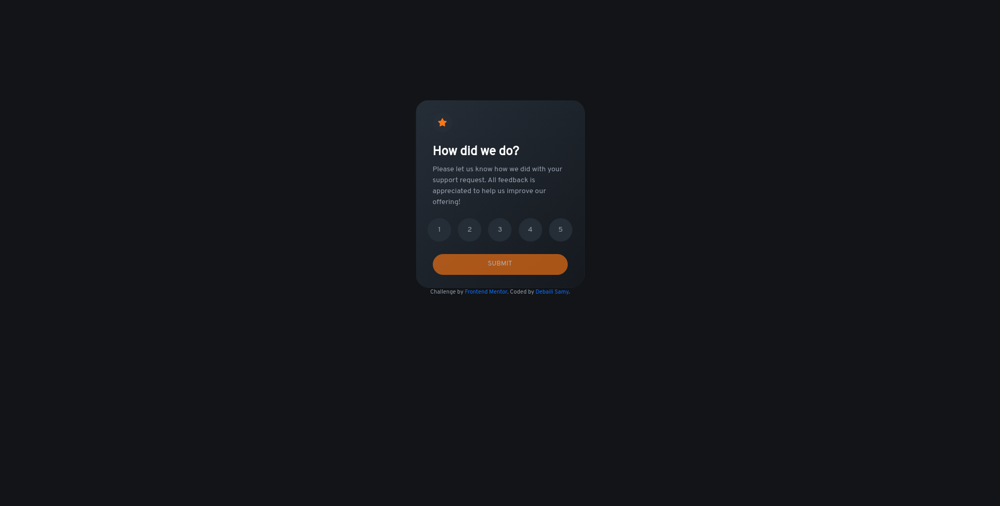

# Frontend Mentor - Interactive rating component solution

This is a solution to the [Interactive rating component challenge on Frontend Mentor](https://www.frontendmentor.io/challenges/interactive-rating-component-koxpeBUmI). Frontend Mentor challenges help you improve your coding skills by building realistic projects. 

## Table of contents

- [Overview](#overview)
- [The challenge](#the-challenge)
- [Screenshot](#screenshot)
- [Links](#links)
- [Built with](#built-with)
- [Author](#author)
- [Acknowledgments](#acknowledgments)

**Note: Delete this note and update the table of contents based on what sections you keep.**

## Overview

### The challenge

Users should be able to:

- View the optimal layout for the app depending on their device's screen size
- See hover states for all interactive elements on the page
- Select and submit a number rating
- See the "Thank you" card state after submitting a rating

### Screenshot

### Links

- Solution URL: [solution URL](https://github.com/samdem-ai/interactive-rating-component)
- Live Site URL: [live site URL](https://samdem-ai.github.io/interactive-rating-component/)

### Built with

- Semantic HTML5 markup
- CSS custom properties
- Flexbox
- Bootstrap 5
- Mobile-first workflow

## Author

- Website - [Debaili samy](https://samdem-ai.github.io/personalSite)
- Frontend Mentor - [@samdem-ai](https://www.frontendmentor.io/profile/samdem-ai)

## Acknowledgments

a big Thank you to both of  colt steele and the net ninja who are helping me through my frontend developenent carrere

